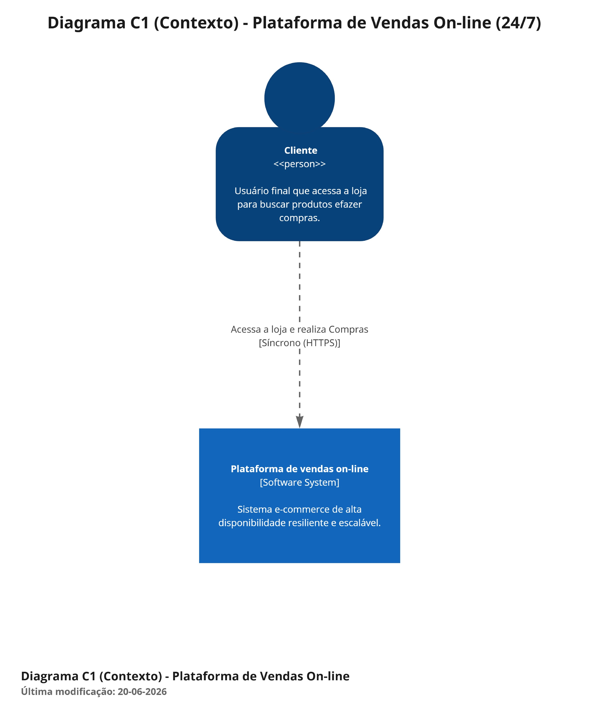
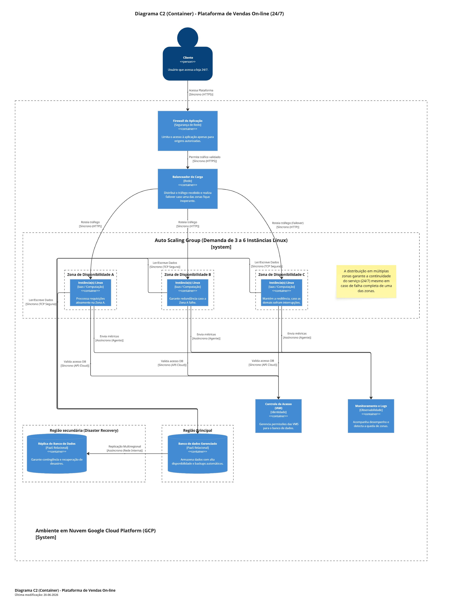
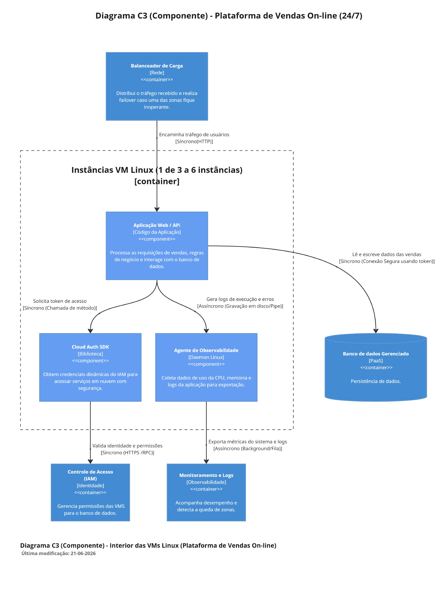

# Desafio Final: Arquiteto de Soluções em Nuvem ☁️

## 📌 Sobre o Projeto
Este repositório contém a documentação e o desenho arquitetural desenvolvidos para o Desafio Final do Bootcamp de Arquiteto(a) de Soluções. 

O cenário proposto simula uma grande empresa de vendas on-line que necessita de uma infraestrutura em nuvem capaz de garantir alta disponibilidade, resiliência e escalabilidade para uma aplicação distribuída. O sistema deve operar 24/7, ser resistente a falhas e lidar eficientemente com variações de demanda.

## 🎯 Requisitos da Arquitetura
A solução foi projetada para atender aos seguintes requisitos técnicos definidos no desafio:
*   **Múltiplas Zonas de Disponibilidade:** Garantia de continuidade do serviço mesmo em caso de falha de uma zona inteira.
*   **Balanceamento de Carga:** Distribuição do tráfego recebido entre as instâncias da aplicação.
*   **Escalonamento Automático (Auto Scaling):** Ajuste dinâmico da infraestrutura, configurado com um mínimo de 3 e máximo de 6 instâncias utilizando imagens Linux.
*   **Banco de Dados Gerenciado (PaaS):** Serviço de banco de dados com alta disponibilidade, backups automáticos e replicação multi-regional para Recuperação de Desastres (Disaster Recovery).
*   **Segurança e IAM:** Controle rigoroso de acesso via firewall e configuração de políticas de IAM para que as instâncias possuam permissões seguras de leitura e escrita no banco de dados.
*   **Monitoramento e Logs:** Acompanhamento contínuo de desempenho, segurança e eventuais falhas do sistema.

## 🏗️ Desenho da Arquitetura (Modelo C4)
A arquitetura foi documentada utilizando o **Modelo C4**, focando nos níveis de **Contexto (C1), Container (C2) e Componente (C3)** para representar a topologia em nuvem. 

> **Boas Práticas Adotadas:** Conforme as diretrizes do C4 Model, todos os relacionamentos no diagrama foram devidamente nomeados e classificados como Síncronos (ex: HTTP, RPC) ou Assíncronos (ex: eventos, replicação), evitando erros clássicos como setas sem significado ou componentes soltos.

### Diagrama de Contexto (Nível C1)

### Diagrama de Container (Nível C2)

### Diagrama de Componente (Nível C3)

## 🛠️ Stack Tecnológica (MVP)  
Embora o desafio exija obrigatoriamente a modelagem da infraestrutura em nuvem de preferência (Google Cloud Platform adotada como base), foi desenvolvido um MVP simulado para rodar sobre esta infraestrutura:  
**Aplicação:** Web API construída em .NET 10 utilizando Minimal APIs.  
**Hospedagem:** O .NET é multiplataforma e roda nativamente no grupo de VMs Linux distribuídas nas zonas.  
**Automação:** Deploy realizado através de Startup Scripts (Bash) que preparam o ambiente Linux, baixam a aplicação de um Bucket (Cloud Storage) e a executam como um serviço do sistema.  

## 🚀 Implementação Prática na Cloud (GCP)  
Para atender à etapa opcional de provisionamento, a arquitetura foi mapeada para os seguintes serviços do Google Cloud Platform (GCP):  

**IAM:** Criação de Service Account com permissões de Cloud SQL Client anexada aos modelos de instância.  
**Segurança (VPC Firewall):** Liberação de portas web apenas do exterior para o Balanceador, e do Balanceador para as VMs.  
**Compute Engine (IaaS):** Configuração de um Managed Instance Group (MIG) utilizando imagem Debian/Ubuntu, distribuído em múltiplas zonas, com Auto Scaling de CPU configurado (mín. 3, máx. 6 instâncias).  
**Cloud Load Balancing:** Balanceador HTTP(S) apontando para o MIG, com Health Checks ativos.  
**Cloud SQL (PaaS):** Banco de dados relacional com Alta Disponibilidade (regional) ativa, além de uma Read Replica provisionada em outra região (ex: us-east1) para atender ao requisito de Disaster Recovery.  
**Cloud Monitoring:** Agente de observabilidade instanciado via script para centralizar a saúde das VMs.  

## 👨‍💻 Sobre o Arquiteto  

No contexto deste projeto, atuo como **Arquiteto(a) de Soluções em uma grande empresa de vendas on-line**. 

Minha principal responsabilidade é construir, documentar e implantar arquiteturas em nuvem que garantam alta disponibilidade, resiliência e escalabilidade para aplicações distribuídas. O foco é manter o sistema disponível 24/7, tornando-o resistente a falhas e capaz de lidar dinamicamente com as variações de demanda. 

**Contato:**
* **Nome:** Francisco Gleidson da Silva Freitas
* **LinkedIn:** https://www.linkedin.com/in/gleidsonfreitas/
* **GitHub:** https://github.com/GLEIDOSN

## 🔗 Links e Referências do Projeto

Abaixo estão os links para os artefatos gerados neste desafio:

* 📄 **Documento Arquitetural:** [Link para abrir no Miro](https://miro.com/app/board/uXjVHEBGqmY=/?share_link_id=472628597186)
* 🖼️ **Vídeo apresentação utilizando NotebookLM do Gemini:**  
<video src="sources/Plataforma_E-commerce_24_7.mp4" controls width="100%">
  Seu navegador não suporta o elemento de vídeo.
</video>
* 💻 **Código do MVP (.NET 10):** **Em Breve**
* 📚 **Boas Práticas C4 Model:** O desenho arquitetural baseou-se nos padrões de relacionamento do C4, garantindo a indicação de comunicação síncrona/assíncrona, a descrição clara de todos os relacionamentos e evitando o erro clássico de deixar "componentes soltos" na arquitetura.
